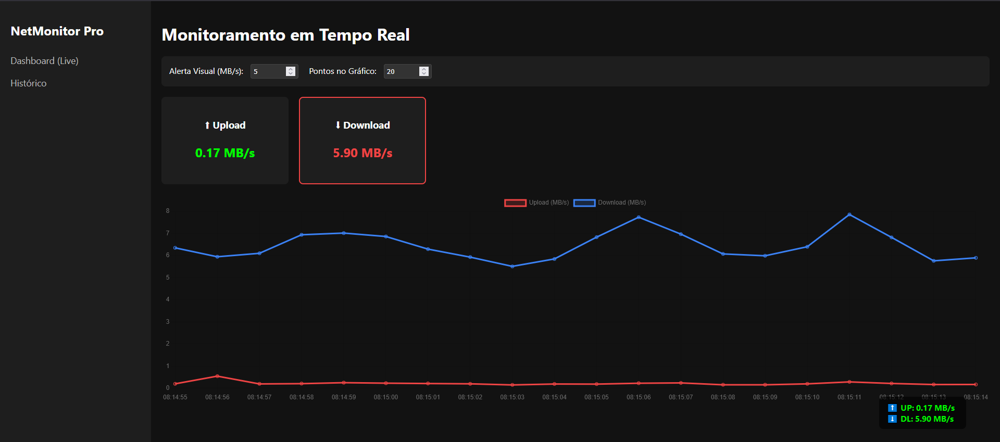

# 🌐 NetMonitor Pro


NetMonitor Pro é uma aplicação fullstack completa para monitoramento de tráfego de rede (upload/download) em tempo real. O sistema conta com uma API robusta, um Dashboard Web moderno e um Widget de Desktop flutuante.

## 📸 Preview



## ✨ Funcionalidades

- **Dashboard Web (React):** Gráficos em tempo real, painel de configurações dinâmico e alertas visuais.
- **Widget Desktop (PyQt6):** Janela flutuante minimalista, transparente e arrastável. Clique com o botão direito para travar/destravar na tela.
- **Backend API (FastAPI):** Coleta de métricas via `psutil`, comunicação via WebSocket para tempo real e REST API para dados históricos.
- **Banco de Dados (SQLite):** Armazenamento de histórico de consumo de rede utilizando SQLAlchemy.

## 🛠️ Tecnologias Utilizadas

- **Backend:** Python, FastAPI, psutil, SQLAlchemy, Uvicorn, WebSockets.
- **Frontend:** React, Vite, Chart.js, Axios.
- **Desktop:** PyQt6, Requests.

## 📁 Estrutura do Projeto

```text
NetMonitor-Pro/
├── backend/       # Lógica do servidor, rotas da API, WebSocket e Banco de Dados
├── frontend/      # Dashboard Web em React + Vite
├── widget/        # Aplicação Desktop em PyQt6
├── config/        # Arquivos de configuração (limites e portas)
└── logs/          # Logs do sistema gerados automaticamente
```

## 🚀 Como Executar Localmente

### 1. Preparando o Ambiente Backend e Widget

Certifique-se de ter o Python 3.9+ instalado. Na raiz do projeto, execute:

```bash
python -m venv venv
venv\Scripts\activate
pip install -r requirements.txt
```

### 2. Preparando o Ambiente Frontend

Certifique-se de ter o Node.js instalado.

```bash
cd frontend
npm install
```

### 3. Iniciando os Serviços

Abra terminais separados na raiz do projeto e execute:

- **Para iniciar a API (Backend):** `python start_backend.py`
- **Para iniciar o Widget Desktop:** `python start_widget.py`
- **Para iniciar o Dashboard Web:** Vá para a pasta `frontend/` e rode `npm run dev`

## 📦 Gerando Executáveis (Windows)

Para compilar o backend e o widget como executáveis `.exe` (sem precisar do Python instalado na máquina de destino), basta rodar o script na raiz do projeto:

```cmd
build_exe.bat
```
Os binários serão gerados na pasta `dist/`.